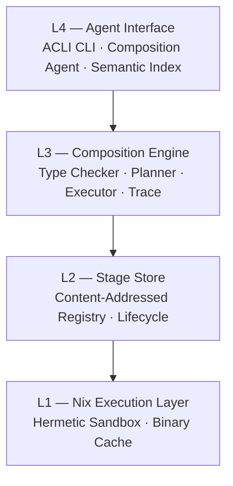

# Architecture Overview

> **Reading this as an AI agent or tooling?** [`AGENTS.md`](../../AGENTS.md) at the repo root is your entry point — denser, keyed by intent, with runnable verification on every fragment. `noether agent-docs` emits the same content as structured JSON.
>
> **Docs philosophy.** Noether's primary readers are AI agents, not humans — agents pay per token and want schema + error codes + "verify with this one-liner," not motivation or analogies. Rather than compromise both audiences with one doc set, Noether maintains two: this overview + [`SECURITY.md`](../../SECURITY.md) + [`STABILITY.md`](../../STABILITY.md) + [Getting started](../getting-started/index.md) for humans; `AGENTS.md` + [`docs/agents/`](../agents/) playbooks for agents. The playbooks are authoritative for API reference; the human docs link into them for depth.

Noether has four layers. Each layer depends only on the one below it.



## L1 — Nix Execution Layer

Stages run inside Nix-managed environments. Each stage declares its language runtime (Python 3.11, Node 20, Bash) and Nix provides a runtime with the exact dependencies pinned to the Nix store hash.

Nix is the **reproducibility boundary**. From v0.7 the separate **isolation boundary** lives in a companion layer: the `noether-isolation` crate + bubblewrap (Phase 1) or native namespaces + Landlock + seccomp (Phase 2, v0.8). `noether run --isolate=auto` (the default from v0.7) wraps every stage subprocess in bwrap when available: UID mapped to `nobody`, fresh namespaces, `/work` sandbox-private tmpfs, `--cap-drop ALL`, new session, env cleared to a short allowlist, network namespace unshared unless the stage declares `Effect::Network`. See [`SECURITY.md`](../../SECURITY.md) for the full threat model and [`docs/roadmap/2026-04-18-stage-isolation.md`](../roadmap/2026-04-18-stage-isolation.md) for the Phase-2 plan.

What you get from L1 when isolation is on:
- The same `StageId` produces the same output on any machine that has Nix.
- No "works on my machine" — dependencies are content-addressed.
- No ambient environment leaks — stages see only `/nix/store`, the noether cache dir, a tmpfs `/work`, and whatever their declared effects open up.
- When `Effect::Network` is declared, the sandbox binds `/etc/resolv.conf`, `/etc/hosts`, `/etc/nsswitch.conf`, `/etc/ssl/certs` (via `--ro-bind-try` so NixOS hosts that manage DNS differently don't break) so DNS + TLS actually work.

Caveat: the sandbox requires `nix` installed under `/nix/store` (upstream or Determinate installer). A distro-packaged `/usr/bin/nix` is dynamically linked against host libraries that aren't bound, so the executor refuses to run under isolation in that configuration with a clear message pointing at the upstream installer.

## L2 — Stage Store

The store is a content-addressed registry of stages. A `StageId` is the SHA-256 hash of the stage's `StageSignature` (input type, output type, effects, implementation hash). Metadata (description, examples, cost hints) does not affect the identity.

Stages have a lifecycle: `Draft → Active → Deprecated → Tombstone`. Only `Active` stages participate in semantic search. Lifecycle transitions are validated — you cannot un-tombstone a stage.

## L3 — Composition Engine

Given a Lagrange JSON graph, the engine:

1. **Type-checks** every edge using structural subtyping (`is_subtype_of`).
2. **Plans** a linear `ExecutionPlan` with dependency tracking and parallelisation groups.
3. **Executes** the plan, routing data between stages.
4. **Traces** every stage input/output for reproducibility and debugging.

The `CompositionId` is the SHA-256 of the graph JSON — the same graph always gets the same ID.

## L4 — Agent Interface

The only public API is the ACLI-compliant CLI. All output is structured JSON. There are no human-readable error strings mixed into stdout.

The **Composition Agent** translates plain-English problem descriptions into Lagrange graphs:

1. Searches the semantic index for the top-20 candidate stages.
2. Builds a prompt with candidates + type system documentation + operator reference.
3. Calls the LLM, parses the JSON response, type-checks it.
4. Retries up to 3 times on type error, including the error message in the retry prompt.

## Crate structure

```
crates/
├── noether-core/    # Type system, effects, stage schema, hashing, stdlib
├── noether-store/   # StageStore trait + MemoryStore + lifecycle
├── noether-engine/  # Graph format, type checker, planner, executor, index, LLM
└── noether-cli/     # ACLI CLI — the only public interface
```

Each crate is independently testable. `noether-core` has zero external dependencies beyond `serde` and `sha2`.
