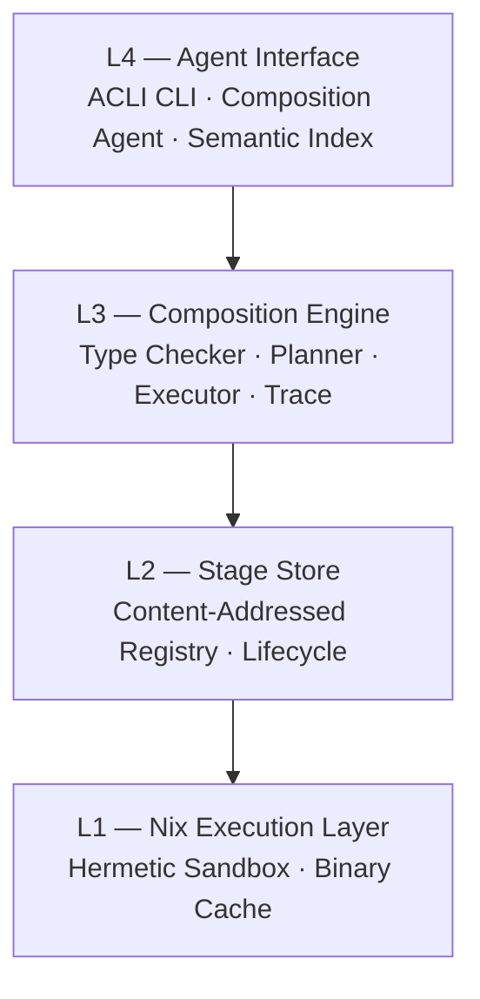

# Architecture Overview

Noether has four layers. Each layer depends only on the one below it.



## L1 — Nix Execution Layer

Stages run inside Nix-managed environments. Each stage declares its language runtime (Python 3.11, Node 20, Bash) and Nix provides a runtime with the exact dependencies pinned to the Nix store hash.

This is a **reproducibility boundary, not an isolation boundary**: the subprocess inherits the host user's privileges, filesystem access, and network. Stages can `os.system(...)`, read `~/.ssh/id_ed25519`, and make arbitrary HTTP calls. Don't execute stages you did not write unless you have independent isolation (bwrap, firejail, nsjail, a container, a throwaway VM).

What you do get:
- The same `StageId` produces the same output on any machine that has Nix.
- No "works on my machine" — dependencies are content-addressed.
- No ambient environment leaks — stages cannot access the host filesystem or network unless their `effects` declare it.

## L2 — Stage Store

The store is a content-addressed registry of stages. A `StageId` is the SHA-256 hash of the stage's `StageSignature` (input type, output type, effects, implementation hash). Metadata (description, examples, cost hints) does not affect the identity.

Stages have a lifecycle: `Draft → Active → Deprecated → Tombstone`. Only `Active` stages participate in semantic search. Lifecycle transitions are validated — you cannot un-tombstone a stage.

## L3 — Composition Engine

Given a Lagrange JSON graph, the engine:

1. **Type-checks** every edge using structural subtyping (`is_subtype_of`).
2. **Plans** a linear `ExecutionPlan` with dependency tracking and parallelisation groups.
3. **Executes** the plan, routing data between stages.
4. **Traces** every stage input/output for reproducibility and debugging.

The `CompositionId` is the SHA-256 of the graph JSON — the same graph always gets the same ID.

## L4 — Agent Interface

The only public API is the ACLI-compliant CLI. All output is structured JSON. There are no human-readable error strings mixed into stdout.

The **Composition Agent** translates plain-English problem descriptions into Lagrange graphs:

1. Searches the semantic index for the top-20 candidate stages.
2. Builds a prompt with candidates + type system documentation + operator reference.
3. Calls the LLM, parses the JSON response, type-checks it.
4. Retries up to 3 times on type error, including the error message in the retry prompt.

## Crate structure

```
crates/
├── noether-core/    # Type system, effects, stage schema, hashing, stdlib
├── noether-store/   # StageStore trait + MemoryStore + lifecycle
├── noether-engine/  # Graph format, type checker, planner, executor, index, LLM
└── noether-cli/     # ACLI CLI — the only public interface
```

Each crate is independently testable. `noether-core` has zero external dependencies beyond `serde` and `sha2`.
