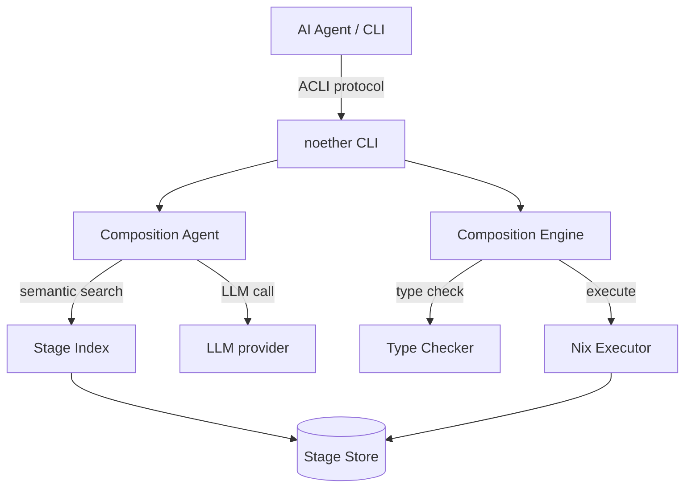

# Noether

**Typed, content-addressed pipelines — reproducible by construction, LLM-assisted by option.**

Decompose computation into stages with structural type signatures. The type checker verifies graph *topology* before execution — it does not prove stage bodies correct. Run stages in a Nix-pinned runtime for byte-identical reproduction, sandboxed by default (v0.7+) via bubblewrap. Replay any run from its composition hash.

!!! tip "Reading this as an AI agent?"
    Start at [`AGENTS.md`](https://github.com/alpibrusl/noether/blob/main/AGENTS.md) and query playbooks via `noether agent-docs`. Dense, intent-keyed, machine-readable. The rest of these docs are human-facing narrative.

!!! info "Trust model — v0.7+"
    The Nix-pinned runtime is the **reproducibility boundary**; the
    bubblewrap sandbox (enabled by default via `--isolate=auto`) is the
    **isolation boundary**. Stages run under a fresh user namespace,
    mapped UID `nobody`, sandbox-private `/work` tmpfs, `--cap-drop ALL`,
    network namespace unshared unless the stage declares `Effect::Network`.
    Pass `--require-isolation` in CI to turn the `auto → none` fallback
    into a hard error. See [SECURITY.md](https://github.com/alpibrusl/noether/blob/main/SECURITY.md) for the full model, including the distro-nix caveat.

```bash
cargo install noether-cli
export NOETHER_REGISTRY=https://registry.alpibru.com

noether compose "parse CSV data and count the rows"
# → { "ok": true, "data": { "output": 3.0 } }
```

[Get started →](getting-started/index.md){ .md-button .md-button--primary }
[Browse the registry →](https://registry.alpibru.com/docs){ .md-button }

---

<div class="grid cards" markdown>

-   :material-lock: **Reproducible by construction**

    Every stage has a SHA-256 content hash. Same hash, same computation,
    on any machine, forever. Replay any past run from its composition ID.

    [→ Stage identity](architecture/stage-identity.md)

-   :material-graph: **Structural typing**

    `Record { a, b, c }` is a subtype of `Record { a, b }`. Composition
    correctness is a theorem, not a test. The type checker catches
    plumbing mistakes before execution.

    [→ Type system](architecture/type-system.md)

-   :material-tag-multiple: **Effects as first-class**

    Every stage declares what it does: `Pure`, `Network`, `Llm`, `Cost`,
    `Process`, `Fallible`. Budget, routing, and policy decisions ride
    on effects instead of being re-derived at runtime.

    [→ Effects](architecture/type-system.md)

-   :material-lightning-bolt: **LLM-assisted authoring (optional)**

    From a plain-English problem to a type-checked executable graph in
    seconds — when you want it. Stages run without any LLM involvement
    unless they explicitly declare `Effect::Llm`.

    [→ `noether compose`](guides/llm-compose.md)

-   :material-magnify: **Semantic search**

    Discover stages by meaning, not by name. Three-index fusion across
    signature, description, examples.

    [→ Semantic search](guides/semantic-search.md)

-   :material-server-network: **Distributed execution (v0.4)**

    `noether-grid` routes stages by declared capability — LLM-bearing
    nodes dispatch to workers with matching access (API keys,
    self-hosted models, or same-org CLI auth), pure work stays local.

    [→ Grid design](research/grid.md)

</div>

---

## What it is

A **stage** is an immutable, content-addressed unit of computation:

```
stage: { input: T } → { output: U }
identity: SHA-256(signature)   ← not a name, not a version, a hash
```

Two stages with the same hash are provably the same computation — across
machines, across repos, forever. The **composition engine** type-checks
every edge of a graph before executing it, using structural subtyping.

```bash
# Ask the LLM to compose a solution, type-check it, and run it
noether compose "find the top 10 trending Rust crates this week"
```

```json
{
  "ok": true,
  "command": "compose",
  "result": {
    "composition_id": "8f3a…",
    "stages_used": 4,
    "llm_calls": 1,
    "type_checked": true,
    "output": { "crates": [ … ] }
  }
}
```

## What it is not

| Noether is | Noether is not |
|---|---|
| A typed stage composition store | A workflow orchestrator (Airflow, Prefect) |
| A content-addressed registry | A package manager (npm, pip, cargo) |
| An ACLI-compliant tool called *by* agents | An AI agent framework (LangChain, AutoGen) |

## Architecture



Four layers — agent interface, composition engine, stage store, execution.
Details: **[Architecture overview →](architecture/overview.md)**

## What's new in v0.7

- **Sandbox by default** — `noether run --isolate=auto` wraps every
  stage subprocess in bubblewrap: fresh namespaces, UID mapped to
  `nobody`, sandbox-private `/work` tmpfs, `--cap-drop ALL`, network
  unshared unless `Effect::Network` is declared. `--require-isolation`
  turns the `auto → none` fallback into a hard error for CI.
- **`noether-isolation` crate** — the sandbox primitive extracted from
  `noether-engine` for non-Rust consumers. Stable Serde-enabled
  `IsolationPolicy` wire format (v0.7.1).
- **`noether-sandbox` binary** — ~300 LOC glue that reads an
  `IsolationPolicy` JSON + argv and runs the command under bwrap.
  What agentspec-shaped callers use instead of building their own
  sandbox.
- **Property DSL expansion** — seven declarative property kinds
  (`SetMember`, `Range`, `FieldLengthEq`, `FieldLengthMax`,
  `SubsetOf`, `Equals`, `FieldTypeIn`) with typed `JsonKind` and
  ingest-time rejection of typo'd property kinds.
- **Resolver everywhere** — signature-pinned graph nodes resolve to
  concrete implementation IDs before every execution path (CLI,
  compose, serve, scheduler, grid-broker, grid-worker, registry).
  `composition_id` is computed pre-resolution so the same source
  graph produces a stable id across days.
- **Stage identity split** — `signature_id` + `implementation_id`.
  Graphs pin by signature; bugfix-only impl rewrites don't break
  pinned references.
- **Agent-facing docs** — [`AGENTS.md`](https://github.com/alpibrusl/noether/blob/main/AGENTS.md)
  at the repo root + 5 intent-keyed playbooks at
  [`docs/agents/`](https://github.com/alpibrusl/noether/tree/main/docs/agents)
  + `noether agent-docs` CLI subcommand.

Full list: **[Changelog →](changelog.md)**.
