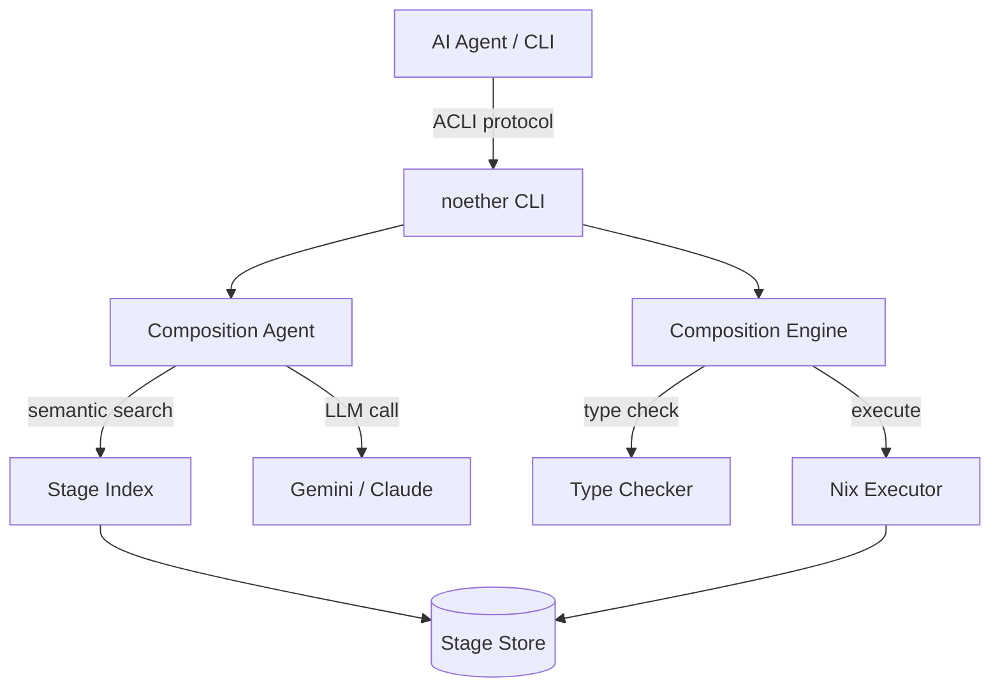

# Noether

**Verified composition platform for AI agents.**

Content-addressed stages · Structural typing · Nix execution · LLM-powered compose

---

<div class="grid cards" markdown>

-   :material-lightning-bolt: **Fast to compose**

    From a plain-English problem description to a type-checked, executable graph in seconds.

    [:octicons-arrow-right-24: Try `noether compose`](getting-started/quickstart.md)

-   :material-lock: **Reproducible by design**

    Every stage has a SHA-256 content hash. The same hash always runs the same code.

    [:octicons-arrow-right-24: Stage identity](architecture/stage-identity.md)

-   :material-graph: **Structural typing**

    `Record { a, b, c }` is a subtype of `Record { a, b }`. Composition correctness is a theorem, not a test.

    [:octicons-arrow-right-24: Type system](architecture/type-system.md)

-   :material-magnify: **Semantic search**

    Agents discover stages by meaning, not by name. Three-index fusion across signature, description, and examples.

    [:octicons-arrow-right-24: Semantic search guide](guides/semantic-search.md)

</div>

---

## What Noether is

Noether is a **composition store** for AI agents. Instead of synthesising code from scratch every session, agents decompose problems into typed, composable **stages** — small units of computation with permanent content-addressed identities — and execute them with reproducibility guarantees.

Named after Emmy Noether's theorem: symmetry implies conservation. In Noether, type signature symmetry *guarantees* composition correctness.

```bash
# Ask the LLM to compose a solution, type-check it, and run it
noether compose "find the top 10 trending Rust crates this week"
```

```json
{
  "ok": true,
  "command": "compose",
  "result": {
    "composition_id": "8f3a…",
    "stages_used": 4,
    "llm_calls": 1,
    "type_checked": true,
    "output": { "crates": [ … ] }
  }
}
```

## What Noether is NOT

| Noether is | Noether is not |
|---|---|
| A stage composition store | A workflow orchestrator (Airflow, Prefect) |
| A type-checked executor | An AI agent framework (LangChain, AutoGen) |
| A content-addressed registry | A package manager (npm, pip, cargo) |
| An ACLI-compliant tool | A frontend framework |

## Architecture at a glance



## Status

| Phase | Focus | Status |
|---|---|---|
| 0 | Foundation — type system, hashing, stage schema | ✅ Done |
| 1 | Store + Stdlib — 76 stdlib stages | ✅ Done |
| 2 | Composition Engine — DAG executor, trace output | ✅ Done |
| 3 | Agent Interface — Composition Agent, semantic index | ✅ Done |
| 4 | Hardening — signatures, deduplication, store health | ✅ Done |
| 5 | Effects v2 — effect inference & enforcement | ✅ Done |
| 6 | NixExecutor hardening — timeout, error classification, warmup | ✅ Done |
| 7 | Cloud Registry hardening — DELETE, paginated refresh, scheduler | ✅ Done |
| 8 | Runtime budget enforcement — `--budget-cents`, `BudgetedExecutor` | ✅ Done |

## Quick install

```bash
cargo install noether-cli
noether version
```

[:octicons-arrow-right-24: Full installation guide](getting-started/installation.md)
