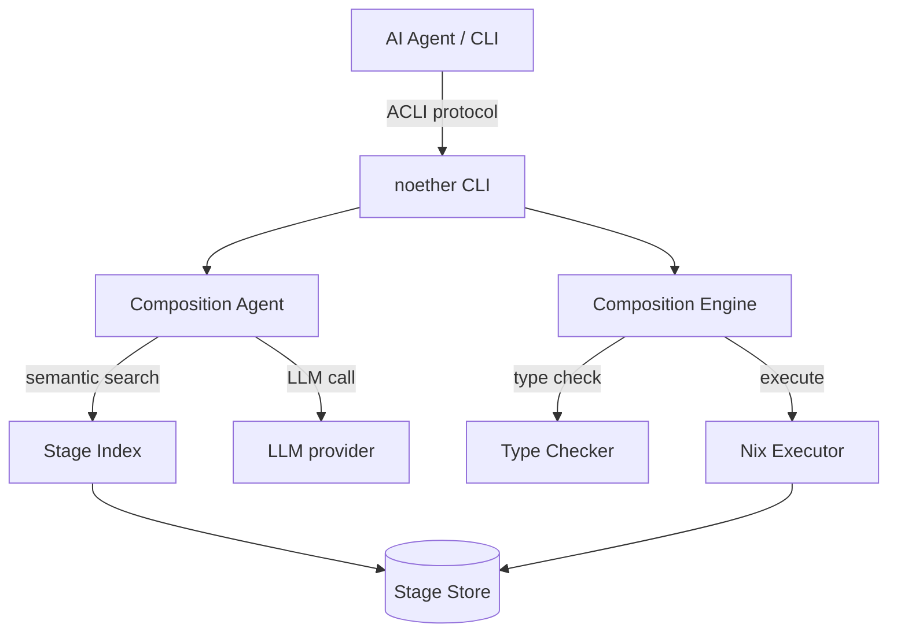

# Noether

**Typed, content-addressed pipelines — reproducible by construction, LLM-assisted by option.**

Decompose computation into stages with structural type signatures. The type checker verifies graph *topology* before execution — it does not prove stage bodies correct. Run stages in a Nix-pinned runtime for byte-identical reproduction. Replay any run from its composition hash.

!!! warning "Reproducibility is not isolation"
    The Nix-pinned runtime fixes the language and library versions so the
    same stage produces the same output. It does **not** sandbox the
    subprocess: stages run with host-user privileges and can read the
    filesystem, make network calls, and read environment variables. Do not
    run stages you did not write without reading [SECURITY.md](https://github.com/alpibrusl/noether/blob/main/SECURITY.md).

```bash
cargo install noether-cli
export NOETHER_REGISTRY=https://registry.alpibru.com

noether compose "parse CSV data and count the rows"
# → { "ok": true, "data": { "output": 3.0 } }
```

[Get started →](getting-started/index.md){ .md-button .md-button--primary }
[Browse the registry →](https://registry.alpibru.com/docs){ .md-button }

---

<div class="grid cards" markdown>

-   :material-lock: **Reproducible by construction**

    Every stage has a SHA-256 content hash. Same hash, same computation,
    on any machine, forever. Replay any past run from its composition ID.

    [→ Stage identity](architecture/stage-identity.md)

-   :material-graph: **Structural typing**

    `Record { a, b, c }` is a subtype of `Record { a, b }`. Composition
    correctness is a theorem, not a test. The type checker catches
    plumbing mistakes before execution.

    [→ Type system](architecture/type-system.md)

-   :material-tag-multiple: **Effects as first-class**

    Every stage declares what it does: `Pure`, `Network`, `Llm`, `Cost`,
    `Process`, `Fallible`. Budget, routing, and policy decisions ride
    on effects instead of being re-derived at runtime.

    [→ Effects](architecture/type-system.md)

-   :material-lightning-bolt: **LLM-assisted authoring (optional)**

    From a plain-English problem to a type-checked executable graph in
    seconds — when you want it. Stages run without any LLM involvement
    unless they explicitly declare `Effect::Llm`.

    [→ `noether compose`](guides/llm-compose.md)

-   :material-magnify: **Semantic search**

    Discover stages by meaning, not by name. Three-index fusion across
    signature, description, examples.

    [→ Semantic search](guides/semantic-search.md)

-   :material-server-network: **Distributed execution (v0.4)**

    `noether-grid` routes stages by declared capability — LLM-bearing
    nodes dispatch to workers with matching access (API keys,
    self-hosted models, or same-org CLI auth), pure work stays local.

    [→ Grid design](research/grid.md)

</div>

---

## What it is

A **stage** is an immutable, content-addressed unit of computation:

```
stage: { input: T } → { output: U }
identity: SHA-256(signature)   ← not a name, not a version, a hash
```

Two stages with the same hash are provably the same computation — across
machines, across repos, forever. The **composition engine** type-checks
every edge of a graph before executing it, using structural subtyping.

```bash
# Ask the LLM to compose a solution, type-check it, and run it
noether compose "find the top 10 trending Rust crates this week"
```

```json
{
  "ok": true,
  "command": "compose",
  "result": {
    "composition_id": "8f3a…",
    "stages_used": 4,
    "llm_calls": 1,
    "type_checked": true,
    "output": { "crates": [ … ] }
  }
}
```

## What it is not

| Noether is | Noether is not |
|---|---|
| A typed stage composition store | A workflow orchestrator (Airflow, Prefect) |
| A content-addressed registry | A package manager (npm, pip, cargo) |
| An ACLI-compliant tool called *by* agents | An AI agent framework (LangChain, AutoGen) |

## Architecture



Four layers — agent interface, composition engine, stage store, execution.
Details: **[Architecture overview →](architecture/overview.md)**

## What's new in v0.2

- **`Let` operator** — carry original-input fields through `Sequential`
  pipelines (solves the canonical scan → hash → diff pattern).
- **`def execute(input)` validated** at `stage add` — no more cryptic
  `NoneType` errors at run time.
- **Stage ID prefix resolution in graphs** — 8-char IDs work everywhere.
- **Hosted public registry** at `registry.alpibru.com` — stdlib + ~400
  curated stages, anonymous read.
- **`stage sync <dir>`** for bulk import · **`stage list --signed-by`** /
  `--lifecycle` / `--full-ids` filters · **stdin piping** to `noether run`.

Full list: **[Changelog →](changelog.md)**.
